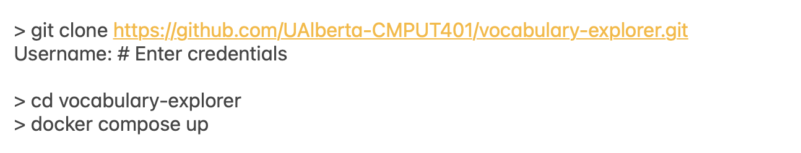

# Final Documentation

## Deployment instructions
!!! note ""
    Deploying the platform requires one instance, just frontend. It requires docker installed.

### Frontend
!!! note "Requirments"
    * Docker
    * Github actions running the Deploy static CI
    * Have the credentials in the project repo

#### STEP BY STEP
!!! note ""
    1. Git clone the repository and make sure you are in the main branch.
    ```
    > git clone https://github.com/UAlberta-CMPUT401/vocabulary-explorer.git
    Username: # Enter credentials
    ```
    2. Change your current directory to vocabulary-explorer
    ```
    > cd vocabulary-explorer
    ```
    3. Make sure your Docker installed and running with the system
    4. Build Docker image by using `docker compose up`. The image should be running on port 8080.
    ```
    > docker compose up
    ```
    5. Open [http://localhost:8080](http://localhost:8080) to view it in your browser.
    6. Clients use Nginx to deploy the docker image to their own server, please contact the ALTlab's backend developer Jolene (jcpoulin@ualberta.ca) for further details.

### Backend
!!! note ""
    Since we are only responsible for developing the frontend page, the backend endpoints are maintained by the client. Please contact ALTlab for further backend deployment details. 

Here are the API endpoints that we used in this project:
```
GET https://api.itwewina.altlab.dev/api/search/
Query Parameters:
    - name (ex: atim)
    - rw_index (ex: 6.3.1.5.1)
    - rw_domain (ex: dog)

GET https://api.itwewina.altlab.dev/api/rapidwords/ 
Query Parameters:
    - q (ex: 1.2.2)
```
Detailed endpoint documentation made by ALTLab can be found [here](https://github.com/UAlbertaALTLab/morphodict-backend).
<!--  -->
<!-- ```
> git clone https://github.com/UAlberta-CMPUT401/vocabulary-explorer.git
Username: # Enter credentials

> cd vocabulary-explorer
> docker compose up
``` -->
## User manual

Open the User Manual here: [User Manual](https://docs.google.com/document/d/1fr063TKXMPJiRLW1hL5pmAlVEqMqVKu8kGue_B_DenY/edit?usp=sharing)

### Design principles and future development ideas

[Click here](https://docs.google.com/document/d/180_0SOf0Af7AX1TUE1i0U1xXyrud_qDjfc7X7Q2GLrE/edit?usp=sharing) to see the Design principles.

## Job description
### Front End Web Developer:
Looking for a front end developer to work on ALTLab’s vocabulary explorer, a web application which allows users to visualize, through tree/graph, the relationships between words within the Plains Cree vocabulary, through linguistic semantic domain classification. 

Check out the current site here: [https://semanticexplorer.altlab.dev/](https://semanticexplorer.altlab.dev/])

!!! note "Responsibilities"
    * Maintain and improve existing Javascript codebase
    * Understand the needs of users to determine design choices, especially as related to the tree/graph
    * Develop new features to improve user experience
    * Write unit, integration, and UI tests

!!! note "Technical requirements"
    * Experience with web development, HTML, CSS, and Javascript, specifically with React.js and D3.js 
    * Understanding of handling API responses
    * Experience with deployment using Docker
    * Experience writing effective tests, specifically utilizing JUnit and Cypress
