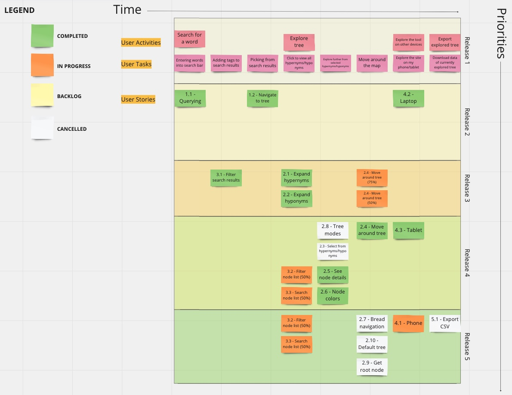

# Project Management

This page provides a general overview of the assigned tasks and roles for the duration of five sprints (subject to change).

## Story Map

## Project Plan
### Sprint 1

_Due: January 28_
#### Tasks

| **Task**                        | **Related US** | **Assigned To**              | **Due Date** |
| ------------------------------- | -------------- | ---------------------------- | ------------ |
| Project Requirements Document   | Documentation  | Damian Li & Yu Liu           | Jan 28       |
| Software Design Document        | Documentation  | Matthew Shocrylas & Saba Gul | Jan 28       |
| Teamwork Document               | Documentation  | Jaden Huang                  | Jan 28       |
| Project Management Document     | Documentation  | Sooraj Arakkal               | Jan 28       |

### Sprint 2

_Due: February 11_

#### User stories

| **User Story** | **Story Points** |
| --- | --- |
| SETUP - Setting up dev environment | 3 |
| US 1.1 - Querying | 3 |
| US 1.2 - Navigate to tree | 5 |
| US 3.1 - Filter search results | 3 |
| US 4.2 - Laptop | 3 |

Estimated sprint velocity: **17**

#### Tasks

| **Task** | **Related US** | **Assigned To** | **Due Date** |
| --- | --- | --- | --- |
| REST API communication | SETUP | Sooraj | Feb 7 |
| d3js installation | SETUP | Damian | Feb 7 |
| React app | SETUP | Sooraj | Feb 7 |
| Call search API with user search term | US 1.1 | Yu | Feb 10 |
| Create search UI  | US 1.1 | Sooraj | Feb 10 |
| Create results page UI  | US 1.1 | Saba | Feb 10 |
| Display search api response as results in result page  | US 1.1 | Yu | Feb 10 |
| Initialize graph instance using d3  | US 1.2 | Matthew | Feb 9 |
| Link result word with graph instance  | US 1.2 | Matthew | Feb 9 |
| Design node in graph UI  | US 1.2 | Matthew | Feb 10 |
| Display selected word in graph UI  | US 1.2 | Matthew | Feb 10 |
| Design tag components in result page  | US 3.1 | Jaden | Feb 11 |
| Add tag functionality in result page  | US 3.1 | Damian | Feb 11 |
| Research responsive frontend frameworks (MaterialUI)  | US 4.2 | Jaden | Feb 8 |
| Implement and enfore usage of frontend framework  | US 4.2 | Jaden | Feb 8 |

### Sprint 3

_Due: March 4_

#### User stories

| **User Story** | **Story Points** |
| --- | --- |
| US 2.1 - Expand hypernyms | 3 |
| US 2.2 - Expand hyponyms | 3 |
| US 2.4 - Move around tree | 5 |
| US 2.8 - Tree modes | 5 |
| US 4.3 - Tablet | 5 |

Estimated sprint velocity: **21**

#### Tasks

| **Task** | **Related US** | **Assigned To** | **Due Date** |
| --- | --- | --- | --- |
| Create develop branch and make it default | DEVOPS | Damian | Feb 20 |
| Communicate with client and make a deployment | DEVOPS | Damian | Feb 20 |
| Create a github workflow that deploys everytime code is pushed to main | DEVOPS | Damian | Feb 20 |
| Create "Hypernyms" button near node (right side) and popup list when button is clicked | US 2.1 | Sooraj | Feb 20 |
| Add functional checkbox beside each hypernym item in popup list | US 2.1 | Sooraj | Feb 20 |
| Call searchRW API when "Hypernyms" button clicked and populate response in popup list | US 2.1 | Matthew | Feb 27 |
| Create "Hyponyms" button near node (left side) and popup list when button is clicked | US 2.2| Saba | Feb 20 |
| Add functional checkbox beside each hyponym item in popup list | US 2.2 | Saba | Feb 20 |
| Call searchRW API when "Hyponyms" button clicked and populate response in popup list | US 2.2 | Matthew | Feb 27 |
| Add zooming functionality and corresponding buttons for graph | US 2.4 | Damian | Feb 25 | 
| Add focus button that takes user back to center of tree | US 2.4 | Damian | Feb 25 |
| Add functionality for user to drag and move around the map with restriction | US 2.4 | Damian | Feb 25 |
| Add flag for english mode/cree mode to be used for api calls and graph generation | US 2.8 | Yu |  Feb 25 |
| Modify graph to show either modes depending on user selection | US 2.8 | Yu | Feb 25 |
| Test website on a tablet and make notes on missing features/usecases | US 4.2 | Jaden | Feb 24 |
| Suggest changes to make website more tablet friendly and review with team | US 4.2 | Jaden | Feb 24 |
| Assign yourself and other team members to make changes deemed doable | US 4.2 | Jaden | Mar 1 |

### Sprint 4

_Due: March 18_

#### User stories

| **User Story** | **Story Points** |
| --- | --- |
| US 2.3 Select from hypernyms/hyponyms | 5 |
| US 2.5 See node details | 5 |
| US 2.6 Node colors | 2 |
| US 3.2 Filter node list | 3 |
| US 3.3 Search node list| 3 |

Estimated sprint velocity: **18**

#### Tasks

| **Task** | **Related US** | **Assigned To** | **Due Date** |
| --- | --- | --- | --- |
| Add api urls to env and use jest mocking to mock url calls | TEST | Sooraj | Mar 14 |
| Improve test coverage of all code | TEST | Damian | Mar 14 |
| Update test report | TEST | Damian | Mar 14 |
| Improve Accessibility patterns in UI | DEVOPS | Saba | Mar 15 |
| Implement hypernym/hyponym buttons in each node | US 2.3 | Matthew | Mar 15 |
| Clicking the button opens a list of the hypernyms/hyponyms | US 2.3 | Jaden | Mar 15 |
| Able to select one or more of the list entries | US 2.3 | Saba | Mar 15 |
| Selections appear as nodes in the tree | US 2.3 | Sooraj | Mar 15 |
| Add ability to filter the list by word type i.e. noun, verb, etc. | US 3.2 | Jaden | Mar 15 |
| Add a search bar to the node list. | US 3.3 | Yu | Mar 15 |
| Ability to filter the rapidwords node cree words list itself | US 3.3 | Sooraj | Mar 15 |
| Ability to click on a cree word in an rapid words node, and have details about it appear in an overlay | US 2.5 | Saba | Mar 17 |
| Implement details in this overlay | US 2.5 | Matthew | Mar 17 |
| Ability to click on the domains in the details to be sent to graph of that domain, similar to results page | US 2.5 | Matthew | Mar 17 |
| Deploy frontend page to client's web server | DEVOPS | Damian | Mar 18 |
| Improve tree UX | US 2.6 | Everyone | Mar 18 |
| Improve visual design of the tree | US 2.6 | Everyone | Mar 18 |
| Delineate “focus” node in a different color from other nodes | US 2.6 | Everyone | Mar 18 |

### Sprint 5

_Due: April 4_

#### User stories

| **User Story** | **Story Points** |
| --- | --- |
| US 4.1 Mobile phone | 8 |
| Homepage visual upgrade| 5 |
| End-to-end testing | 5 |
| Unit testing | 3 |
| Component testing | 3 |
| Quality of life updates and general visual upgrades | 3 |
| User testing, bug discovery and handling | 3 | 
| Wordnet graph support (if backend is up) | 5 |

Estimated sprint velocity: **35**

#### Tasks

| **Task** | **Related US** | **Assigned To** | **Due Date** |
| --- | --- | --- | --- |
| Test website on a phone, assess usability and make a report | US 4.1 | Sooraj | Mar 25 |
| Suggest fixes and assign everyone tasks to make the website more responsive | US 4.1 | Saba | Apr 1 |
| Make homepage look less bland by adding user guide and/or expanding the search to entire page | UI | Matt | Mar 25 |
| Test user searching and entering tree page | TEST | Damian | Apr 1 |
| Test user interacting everything in tree page | TEST | Michael | Mar 25 |
| Test user interacting with everything in results page | TEST | Sooraj | Mar 25 |
| Write unit tests for API call functions | TEST | Saba | Apr 1 |
| Write unit tests for util functions | TEST | Matt | Mar 25 |
| Write unit tests for general functions | TEST | Damian | Apr 1 |
| Write component tests for all componentes | TEST | Michael | Mar 25 |
| Increase spacing between nodes in tree| UI | Jaden | Apr 1 |
| Make cree word generation button be center of the node list | UI | Sooraj | Mar 25 |
| Choose better color for level coloring for tree | UI | Saba | Apr 1 |
| Have consistent coloring for the entire website | UI | Matt | Mar 25 |
| Handle graphs page sometimes blowing up | BUG | Damian | Mar 25 |
| Write API functions for wordnet | WN | Matt | Mar 25 |
| Modify tree to work for wordnet API | WN | Jaden | Apr 1 |

