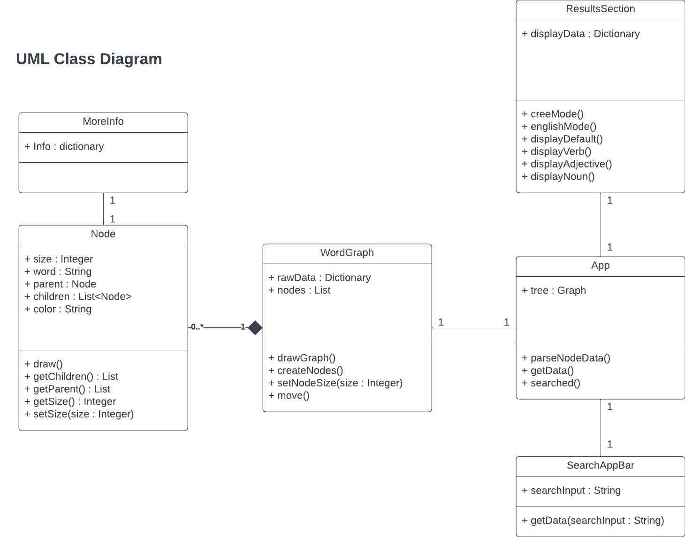

# Software Design


## Architecture Diagram
This is a diagram of the client's full architecture. However, for this project creating the Vocabulary Explorer, we will only be interacting with the presentation and business layers.


## UML Diagram
### UML Class Diagram

### UML Components Diagram


## Low-fidelity User Interfaces and Storyboard Sequence 


## Interaction Scenarios


## API Endpoints
```
GET https://api.itwewina2.altlab.dev/api/search/
Query Parameters:
    - name (ex: atim)
    - rw_index (ex: 6.3.1.5.1)
    - rw_domain (ex: dog)

GET https://api.itwewina2.altlab.dev/api/rapidwords/ 
Query Parameters:
    - q (ex: 1.2.2)
```
Detailed endpoint documentation made by ALTLab can be found [here](https://github.com/UAlbertaALTLab/morphodict-backend).
