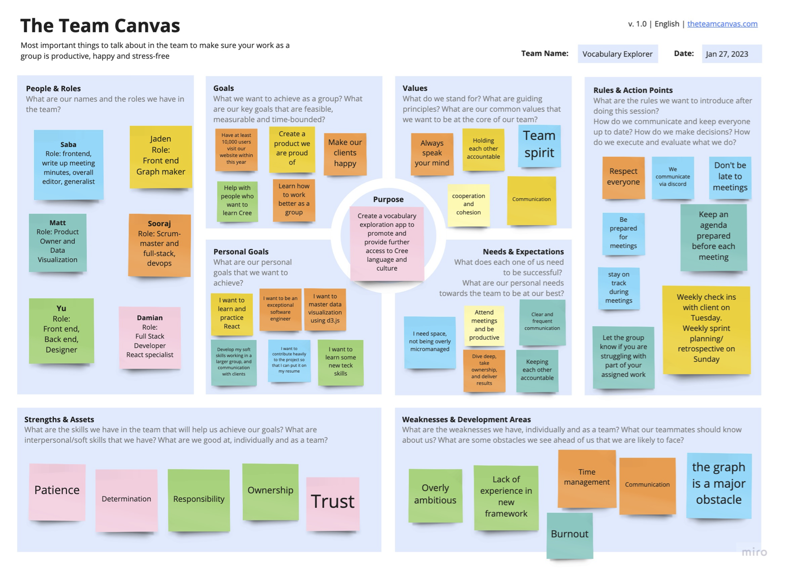

# Teamwork

## Team Canvas

## Belbin Roles
|  Member Name  | Preferred Roles | Manageable Roles | Least Preferred Roles |
| ------------- | ------------- | ------------- | ------------- |
| Ke Li  | IMP ME SH | CF PL RI | CO SP TW |
| Sooraj Arakkal | CF IMP SP | CO PL SH | ME RI TW |
| Matthew Shocrylas | IMP ME SP | CF PL TW | CO RI SH |
| Jaden Huang | CF CO PL | IMP SP TW | ME RI SH |
| Yu Liu | CO ME TW | CF IMP RF | PL SH SP |
| Saba Gul  | IMP ME TW | CO PL SP | CF RI SH |

## Thinking Roles

### PL (Plant)
!!! note ""
    Tends to be highly creative and good at solving problems in unconventional ways.
* Jaden Huang (preferred)
* Ke Li (manageable)
* Sooraj Arakkal (manageable)
* Matthew Shocrylas (manageable)

### ME (Monitor Evaluator)
!!! note ""
    Provides a logical eye, making impartial judgements where required and weighs up the team's options in a dispassionate way.
* Ke Li (preferred)
* Matthew Shocrylas (preferred)
* Yu Liu (preferred)
* Saba Gul (preferred)

### SP (Specialist)
!!! note ""
    Brings in-depth knowledge of a key area to the team.
* Sooraj Arakkal (preferred)
* Matthew Shocrylas (preferred)
* Jaden Huang (manageable)

## Action Roles
### SH (Shaper)
!!! note ""
    Provides the necessary drive to ensure that the team keeps moving and does not lose focus or momentum.
* Ke Li (preferred)
* Sooraj Arakkal (manageable)

### IMP (Implementer)
!!! note ""
    Needed to plan a workable strategy and carry it out as efficiently as possible.
* Ke Li (preferred)
* Sooraj Arakkal (preferred)
* Matthew Shocrylas (preferred)
* Saba Gul (preferred)

### CF (Completer Finisher)
!!! note ""
    Most effectively used at the end of tasks to polish and scrutinise the work for errors, subjecting it to the highest standards of quality control.
* Sooraj Arakkal (preferred)
* Jaden Huang (preferred)

## People Roles
### RI (Resource Investigator)
!!! note ""
    Uses their inquisitive nature to find ideas to bring back to the team.
* Ke Li (manageable)

### TW (Teamworker)
!!! note ""
    Helps the team to gel, using their versatility to identify the work required and complete it on behalf of the team.

* Yu Liu (preferred)
* Saba Gul (preferred)

### CO (Co-ordinator)
!!! note ""
    Needed to focus on the team's objectives, draw out team members and delegate work appropriately.

* Jaden Huang (preferred)
* Yu Liu (preferred)
* Sooraj Arakkal (manageable)
* Saba Gul (manageable)

## Scrum Roles
!!! note ""
    #### Sprint 1

    Product Owner: Matthew Shocrylas

    Scrum Master: Sooraj Arakkal	

!!! note ""
    #### Sprint 2

    Product Owner: Matthew Shocrylas

    Scrum Master: Sooraj Arakkal	

!!! note ""
    #### Sprint 3

    Product Owner: Matthew Shocrylas

    Scrum Master: Sooraj Arakkal

!!! note ""
    #### Sprint 4

    Product Owner: Matthew Shocrylas

    Scrum Master: Sooraj Arakkal

!!! note ""
    #### Sprint 5

    Product Owner: Matthew Shocrylas & Saba Gul

    Scrum Master: Sooraj Arakkal 
    
## Meeting Minutes
Hosted on Google Docs: [Client Meeting Minutes](https://drive.google.com/drive/folders/1nzFJ0_fu0l4dyc9CU1SEOMXON1Vcdy8C?usp=share_link) &  [Internal Meeting Minutes](https://drive.google.com/drive/folders/1R4HYSUunhN3mV-zSzvbbyoVy-o7Fol1f?usp=share_link)
