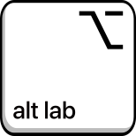

# Welcome to vocabulary-explorer

# vocabulary-explorer
Vocabulary Explorer (ALTLab, U of A)

<h3 align="left">Languages and Tools:</h3>

        

## Project description
ALTLab's vocabulary explorer is a way to explore information based on semantic class, or general meaning group. It is based off of the RapidWords semantic classification. The explorer allows users to expand or collapse different semantic classes through the form of a tree in order to see which word(s) fall under that category, and the relationships between categories. It also links to Itwêwina, ALTLab's Plains Cree dictionary in order to show paradigms when appropriate. 

Users will primarily be linguists and language learners. The explorer will present itself as an interactive graph with nodes that users can click on to expand a section further and gain more information. Graph nodes will be grouped based on semantic class and get more specific as the user clicks through. Each node will also display the word(s) we have in our dictionary that belong to that semantic class. Definitions can be linked at the word-level and direct the user to itwêwina.

### Frontend Deployment: 
[Visit our auto-deployed website.](https://semanticexplorer.altlab.dev/)

### MKdocs documentation: 
[Visit our auto-deployed online documentation.](https://ualberta-cmput401.github.io/vocabulary-explorer/)

### Video Demo: 
[Click here](https://drive.google.com/file/d/1VrbwAj4GEkQkV125cbPc5nKycwRVjg8p/view?usp=sharing) watch on Google drive.

### Test Report
To view the test report, click [here](assets/html/test-report.html).

## Docker instructions

### `docker compose up`

In the root directory, use the `docker-compose.yml` to trigger the deployment.

Open [http://localhost:8080](http://localhost:8080) to view it in your browser.

## Installation & Usage instructions

In the project directory, you can run:
first do `cd frontend & npm install --force`

### `npm start`

Runs the app in the development mode.

Open [http://localhost:3000](http://localhost:3000) to view it in your browser.

The page will reload when you make changes.

You may also see any lint errors in the console.

### `npm test`

Launches the test runner in the interactive watch mode.

See the section about [running tests](https://facebook.github.io/create-react-app/docs/running-tests) for more information.

### `npm run build`

Builds the app for production to the `build` folder.

It correctly bundles React in production mode and optimizes the build for the best performance.

The build is minified and the filenames include the hashes.

Your app is ready to be deployed!

See the section about [deployment](https://facebook.github.io/create-react-app/docs/deployment) for more information.

### `npm run eject`

**Note: this is a one-way operation. Once you `eject`, you can't go back!**

If you aren't satisfied with the build tool and configuration choices, you can `eject` at any time. This command will remove the single build dependency from your project.

Instead, it will copy all the configuration files and the transitive dependencies (webpack, Babel, ESLint, etc) right into your project so you have full control over them. All of the commands except `eject` will still work, but they will point to the copied scripts so you can tweak them. At this point you're on your own.

You don't have to ever use `eject`. The curated feature set is suitable for small and middle deployments, and you shouldn't feel obligated to use this feature. However we understand that this tool wouldn't be useful if you couldn't customize it when you are ready for it.

## Open-source Projects
#### [UAlbertaALTLab](https://github.com/UAlbertaALTLab)
* 21st century tools for Indigenous languages
* User can search English and Cree words
* User can get information and pronunciation for each words.
#### [RapidWords](https://semdom.org/) 
- A web-based tool for text summarization and keyword extraction. The website offers a user-friendly interface and allows users to upload documents or paste text directly into the website for summarization.

#### [WordNet](http://wordnetweb.princeton.edu/perl/webwn) 
- A lexical database for the English language, developed by Princeton University. It organizes words into sets of synonyms and organizes them into semantic hierarchies, allowing for a better understanding of how words are related semantically. The website provides a user-friendly interface for accessing and exploring the WordNet database, allowing users to search for words and their definitions, synonyms, and related concepts.

#### [Itwêwina](https://itwewina.altlab.app/) 
- A web-based platform for learning Cree, an indigenous language of Canada. The platform offers interactive lessons and exercises to help users learn the basics of Cree, including vocabulary, grammar, and pronunciation. It also features a variety of resources, including audio recordings, to help users improve their listening and speaking skills in the language.

## Developer Team
|  Member Name  | CCID |
| ------------- | ------------- |
| Sooraj Arakkal | arakkals |
| Ke Li  | kli1  |
| Matthew Shocrylas | shocryla |
| Jaden Huang | sxhuang |
| Yu Liu | yliu30 |
| Saba Gul  | gul |

## Technical Resources
#### Frontend: React.js + D3.js
* [React JS documentation](https://reactjs.org/)
* [D3 documentation](https://d3js.org/)
#### Backend: Django + SQLite3
* [Django Documentation](https://docs.djangoproject.com/en/4.1/)
* [SQLite3 Documentation](https://sqlite.org/docs.html)
#### Deployment: Docker + NGINX
* [Docker Documentation](https://docs.docker.com/)
* [NGINX Documentation](https://docs.nginx.com/)

